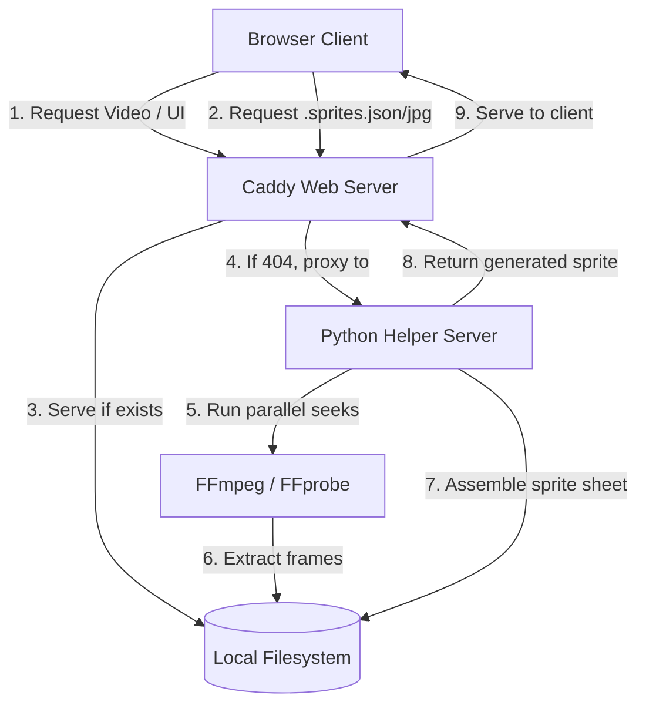

# Simple Media Server 🎬

A lightweight, zero-configuration, cross-platform media server that streams local directories and generates interactive seek-bar sprite thumbnails on-demand. Powered by **Python**, **Caddy**, and **FFmpeg**.

It can be run instantly without installation using `uvx`.

---

## Features

- 🚀 **Zero-Config Streaming**: Run one command to serve any local media directory.
- 🖼️ **On-Demand Sprite Generation**: Automatically generates sprite sheets (`.sprites.jpg` & `.sprites.json`) for video seek-bar previews when a video is loaded.
- ⚡ **High-Performance Caching**: Caddy serves existing sprites directly. If they don't exist, requests are routed to a Python background service that generates them and caches them on disk.
- 🖥️ **Interactive Web Interface**: A sleek, dark-themed responsive sidebar file browser and integrated Video.js player.
- 🔀 **Cross-Platform**: Full support for macOS, Linux, and Windows.
- 🛡️ **Dependency Verification**: Validates that Caddy and FFmpeg are installed and accessible on your path before launching the server.

---

## Architecture



1. **Caddy** serves the user interface (`app.html`), provides the JSON file browsing directory API (`/_ls/*`), and streams video files directly with support for HTTP range requests (essential for fast seeking).
2. When a video starts playing, the client requests its sprite configuration (`<video>.sprites.json`).
3. Caddy checks if the `.sprites.json` (and subsequent `.sprites.jpg`) files exist on disk.
4. If they **do not exist**, Caddy proxies the request to the background Python helper.
5. The Python helper uses **parallel FFmpeg software decoding seeking** to quickly extract frames across the video duration, assembles them into a sprite sheet using **Pillow**, writes the results to disk, and serves them.
6. Subsequent requests for the same sprite sheet are served instantly by Caddy directly from disk.

---

## Prerequisites

Before running, ensure you have the following installed and available on your system path:
1. **Caddy**: High-performance web server.
   - macOS: `brew install caddy`
   - Linux: `sudo apt install caddy`
   - Windows: `choco install caddy`
2. **FFmpeg & FFprobe**: Used for video thumbnail generation.
   - macOS: `brew install ffmpeg`
   - Linux: `sudo apt install ffmpeg`
   - Windows: `choco install ffmpeg`
3. **Python 3.10+**

---

## Quick Start

You can run the server directly from GitHub or a local repository using `uvx`:

```bash
# From GitHub repository
uvx --from git+https://github.com/dev-ansung/simple-media-server.git serve /path/to/videos

# From local clone
uvx --from . serve /path/to/videos
```

If no directory is specified, it will default to looking for a `videos/` folder in the current directory or fall back to serving the current directory.

### CLI Options

```text
usage: serve [-h] [--port PORT] [directory]

Serve a media directory with Caddy and on-demand sprite generation.

positional arguments:
  directory    Media directory to serve (default: ./videos or current dir)

options:
  -h, --help   show this help message and exit
  --port PORT  Port to listen on (default: 8080)
```

---

## On-Demand Sprite Generation Details

Our sprite generator creates 30 high-quality thumbnails distributed evenly across the video timeline, stitched horizontally into a single `.sprites.jpg` file alongside a `.sprites.json` configuration for the Video.js sprite plugin.

To ensure performance under **5 seconds** even for large 4K videos:
- It runs parallel `-ss` seeking before the `-i` parameter (using software decode).
- Spawns concurrent worker threads (`ThreadPoolExecutor`) to extract frames simultaneously.
- Assembles frames instantly using PIL (Pillow) and saves them in JPEG format with optimized compression.

---

## Development Setup

If you want to contribute or run the server locally:

1. Clone the repository:
   ```bash
   git clone https://github.com/dev-ansung/simple-media-server.git
   cd simple-media-server
   ```

2. Create a virtual environment and install dependencies:
   ```bash
   uv venv
   source .venv/bin/activate  # On Windows: .venv\Scripts\activate
   uv pip install -e .
   ```

3. Run the server locally:
   ```bash
   python serve.py ./videos
   ```

## License

MIT License
